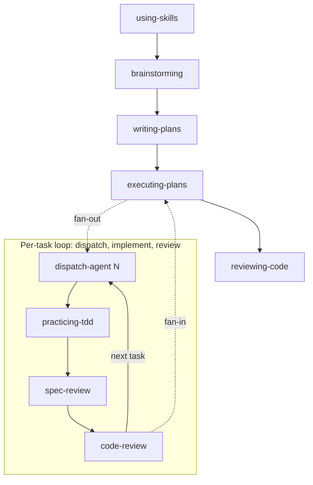

# Keep it Short and Simple Agentic Development Framework

A library of skills that make AI agents more reliable without the complexity of multi-agent setups, custom commands, or role-specific orchestration. Keep it Short and Simple!

Drop them into any coding agent — OpenCode, Claude Code, Cursor — and the agent follows your team's practices instead of guessing what "good" looks like. One agent, a library of skills. That's the idea.

Heavily influenced by [Superpowers](https://github.com/obra/superpowers), [skills](https://github.com/mattpocock/skills), and Anthropic's [Skill authoring best practices](https://platform.claude.com/docs/en/agents-and-tools/agent-skills/best-practices).

## Table of Contents

- [Skills](#skills)
- [Installation](#installation)
  - [OpenCode](#opencode)
  - [Claude Code](#claude-code)
  - [GitHub Copilot CLI](#github-copilot-cli)
  - [Cursor](#cursor)
- [Verification](#verification)
- [Updating](#updating)
- [Contributing](#contributing)

## Skills

Every session starts with `using-skills` — a guardrail that forces the agent to find and load the right skill before doing anything else. From there the workflow follows a natural rhythm: `brainstorming` to explore and design, `writing-plans` to turn the design into categorized tasks (coding vs non-coding), `executing-plans` to dispatch each task to an isolated subagent, `practicing-tdd` which each subagent follows to implement with tests first, and `reviewing-code` to catch issues before merge. When something breaks, `debugging` makes sure the agent finds the root cause before proposing a fix.



| Skill             | What it enforces                                               |
| ----------------- | -------------------------------------------------------------- |
| `using-skills`    | Skill discovery and invocation before any action               |
| `brainstorming`   | Design before implementation — explore, question, get approval |
| `writing-plans`   | Executable plans with acceptance criteria per task             |
| `executing-plans` | Isolated subagent tasks with spec and code review gates        |
| `practicing-tdd`  | Test-first discipline — no code without a failing test         |
| `reviewing-code`  | Five-axis review with structured severity-labeled feedback     |
| `debugging`       | Root cause investigation before any fix                        |

## Why it works

This framework throws out the multi-agent playbook. No swarms, no role-specific agents, no custom commands to wire up. One agent, a library of skills. The agent figures out what needs to be done — the skill makes sure it follows best practices doing it. That's what Keep it Short and Simple means: fewer agents, fewer abstractions, fewer things to break.

**`using-skills` is the secret sauce.** Directly inspired by [obra/superpowers](https://github.com/obra/superpowers), the meta-skill forces agents to discover and invoke skills before acting. Instead of letting agents fall back to their default behavior, `using-skills` routes every session through the framework — skill adoption is enforced, not optional. This is what makes the library more than a collection of files.

**When an agent is about to cut a corner — skip the failing test, guess at a root cause — the skill catches it.** Red flags and HARD-GATEs turn "I know it works" into "prove it." It sounds rigid, but it saves the time you'd waste on wrong fixes.

**Write a skill once and every session across every agent benefits.** The library pays for itself faster than you can maintain it.

## When it doesn't

**This approach assumes a generalist agent that picks up skills as needed.** If you've already tuned agents for specific roles — a frontend agent, a devops agent — the generic skill dispatcher can step on their toes. Skip `using-skills` when your agent's instructions are already tight enough.

**It also assumes your agent can follow multi-step instructions reliably.** Some models treat process steps as suggestions and will blow past a HARD-GATE without reading it.

## Installation

**Recommended**: Use [skills.sh](https://www.skills.sh/) via `npx skills`:

```bash
npx skills add MarcosX/kiss-agentic-development --global --all
```

Or install to specific agents:

```bash
npx skills add MarcosX/kiss-agentic-development --global --agent opencode
npx skills add MarcosX/kiss-agentic-development --global --agent claude-code
```

If you don't want to use `npx skills`, point your agent to `https://raw.githubusercontent.com/MarcosX/kiss-agentic-development/refs/tags/latest/INSTALL.prompt.md` and it will clone the repo according to your coding agent.

Skills are installed via `npx skills` into `~/.agents/skills/` and symlinked across all supported agents. The `--all` flag auto-discovers all skill subdirectories at the repo root — no need to list them individually. To avoid having to always instruct agents to use the `using-skills` skill, configure your agent to auto-load it when starting a new session.

### OpenCode

Configure your global opencode config to inject it into every session via the [`instructions`](https://opencode.ai/docs/config#instructions) field.

Add to `~/.config/opencode/opencode.json`:

```json
{
  "instructions": ["~/.agents/skills/using-skills/SKILL.md"]
}
```

The path points to where `npx skills` installs the skill globally. Because `instructions` directly injects the SKILL.md content into every session, the agent automatically has the skill in context — it does **not** need to invoke the `skill` tool to load it (and the skill's built-in recursion guard prevents re-invocation). See [opencode config docs](https://opencode.ai/docs/config) for more details.

### Claude Code

To ensure `using-skills` is always present, add a reference in your global [`CLAUDE.md`](https://code.claude.com/docs/en/memory) at `~/.claude/CLAUDE.md`:

```markdown
<CRITICAL>
You MUST load and follow the `using-skills` skill before responding to the user. This is mandatory.

1. Use the `skill` tool to load `using-skills` — reading this file is NOT enough
2. Follow all instructions in the loaded skill before proceeding
3. Only after steps 1–2, respond to the user

This is not negotiable and cannot be bypassed.
</CRITICAL>
```

This instructs Claude to load the skill at the start of every session. See [Claude Code memory docs](https://code.claude.com/docs/en/memory) for more details.

### GitHub Copilot CLI

GitHub Copilot reads a global custom instructions file at `~/.copilot/copilot-instructions.md`. Add a reference to load `using-skills` in every session.

Create `~/.copilot/copilot-instructions.md`:

```markdown
<CRITICAL>
You MUST load and follow the `using-skills` skill before responding to the user. This is mandatory.

1. Use the `skill` tool to load `using-skills` — reading this file is NOT enough
2. Follow all instructions in the loaded skill before proceeding
3. Only after steps 1–2, respond to the user

This is not negotiable and cannot be bypassed.
</CRITICAL>
```

This instructs Copilot to load the skill at the start of every session. See [Copilot CLI reference](https://docs.github.com/en/copilot/reference/copilot-cli-reference/cli-config-dir-reference).

### Cursor

To auto-load `using-skills` globally, add a [User Rule](https://cursor.com/docs/rules#user-rules) in Cursor Settings > Rules > User Rules with content:

```markdown
<CRITICAL>
You MUST load and follow the `using-skills` skill before responding to the user. This is mandatory.

1. Use the `skill` tool to load `using-skills` — reading this file is NOT enough
2. Follow all instructions in the loaded skill before proceeding
3. Only after steps 1–2, respond to the user

This is not negotiable and cannot be bypassed.
</CRITICAL>
```

For project-level auto-loading, create `.cursor/rules/using-skills.mdc`:

```markdown
---
description: Always check and invoke skills before acting
alwaysApply: true
---

<CRITICAL>
You MUST load and follow the `using-skills` skill before responding to the user. This is mandatory.

1. Use the `skill` tool to load `using-skills` — reading this file is NOT enough
2. Follow all instructions in the loaded skill before proceeding
3. Only after steps 1–2, respond to the user

This is not negotiable and cannot be bypassed.
</CRITICAL>
```

This instructs Cursor to load the skill at the start of every session. See [Cursor rules docs](https://cursor.com/docs/rules) for more details.

## Verification

After installation, confirm the skills are the expected version:

```bash
head -4 ~/.agents/skills/brainstorming/SKILL.md
```

Check that the `description` field matches the table above. If it looks stale or you see fewer than 7 skill directories under `~/.agents/skills/`, run the update command below.

## Updating

`npx skills update` may fail for this repo (SSH fetch issues). The reliable workaround is a clean re-install:

```bash
npx skills add MarcosX/kiss-agentic-development --global --all -y
```

This re-clones the repo and replaces all skill files. To verify the update landed, check the brainstorming description or any other changed content.

## Contributing

For local development setup, adding new skills, and validation strategy, see [CONTRIBUTING.md](CONTRIBUTING.md) and [AGENTS.md](AGENTS.md).
