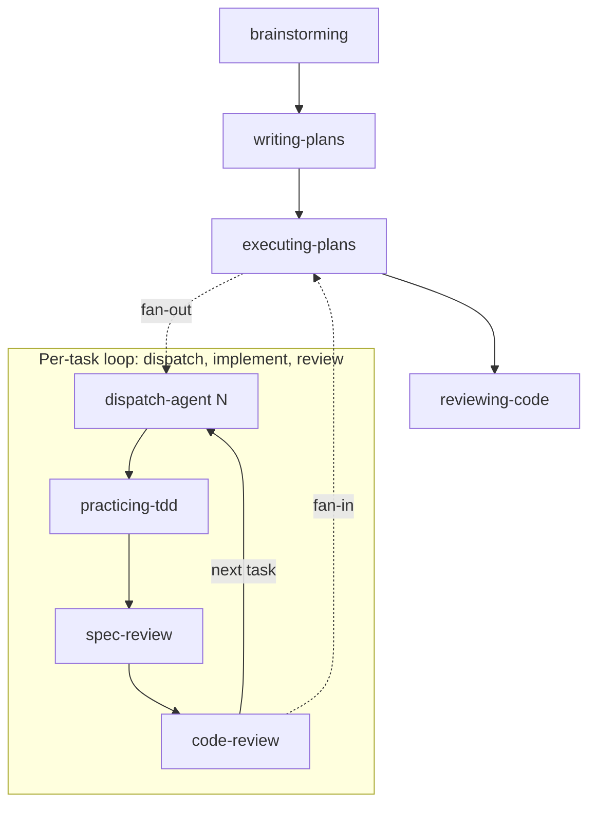

# Keep it Short and Simple Agentic Development Framework

A library of skills that make AI agents more reliable without the complexity of multi-agent setups, custom commands, or role-specific orchestration. Keep it Short and Simple!

Drop them into any coding agent — OpenCode, Claude Code, Cursor — and the agent will leverage skills instead of guessing what "good" looks like. One agent, a library of skills. That's the idea.

## Table of Contents

- [How it works](#how-it-works)
- [When it doesn't](#when-it-doesnt)
- [Why use it?](#why-use-it)
- [Skills](#skills)
- [Installation](#installation)
  - [OpenCode](#opencode)
  - [Claude Code](#claude-code)
  - [GitHub Copilot CLI](#github-copilot-cli)
  - [Cursor](#cursor)
- [Verification](#verification)
- [Updating](#updating)
- [Contributing](#contributing)
- [References](#references)

## How it works

This framework throws out the multi-agent playbook. No swarms, no role-specific agents, no custom commands to wire up. One agent, a library of skills. The agent figures out what needs to be done — the skill makes sure it follows best practices doing it. That's what Keep it Short and Simple means: fewer agents, fewer abstractions, fewer things to break.

**The secret sauce is a global instruction.** Every session starts with a simple rule: check for skills before you do anything. This instruction is loaded automatically — the agent doesn't need to discover or load it. It's always there, forcing every interaction through the skill framework. Skill adoption is enforced, not optional.

**When an agent is about to cut a corner — skip the failing test, guess at a root cause — the skill catches it.** Red flags and HARD-GATEs turn "I know it works" into "prove it." It sounds rigid, but it saves the time you'd waste on wrong fixes.

**Write a skill once and every session across every agent benefits.** The library pays for itself faster than you can maintain it.

## When it doesn't

**This approach assumes a generalist agent that picks up skills as needed.** If you've already tuned agents for specific roles — a frontend agent, a devops agent — the global skill-checking instruction can step on their toes. Skip it when your agent's instructions are already tight enough.

**It also assumes your agent can follow multi-step instructions reliably.** Some models treat process steps as suggestions and will blow past a HARD-GATE without reading it.

## Why use it?

Most skills provide list of guidelines that agents can rationalize around or misinterpret, especially on less capable models. **KISS skills provide a tight workflow**, with clear reasoning and a workflow the agent must follow.

Another commong issue is that most skill are written for humans, not agents — verbose prose, token-heavy tables, and diagrams that cost context without adding signal. **KISS skills follow an agent-first authoring pattern**: flat structure, clear reasoning over bare imperatives, no visual formatting that wastes tokens.

**Each skill is validated against behavioral test scenarios** (see `test/prompts/`) that verify the skill produces the intended agent behavior — not just that keywords are present.

## Skills

Every session is gated by a [global using-skills instruction](instructions/using-skills.md) that forces the agent to find and invoke the right skill before doing anything else.

From there the workflow follows a natural rhythm: `brainstorming` to explore and design, `writing-plans` to turn the design into categorized tasks (coding vs non-coding), `executing-plans` to dispatch each task to an isolated subagent, `practicing-tdd` which each subagent follows to implement with tests first, and `reviewing-code` to catch issues before merge.

When something breaks, `debugging` makes sure the agent finds the root cause before proposing a fix.



| Skill             | What it enforces                                                                                                           |
| ----------------- | -------------------------------------------------------------------------------------------------------------------------- |
| `brainstorming`   | Design before implementation — explore, question, get approval                                                             |
| `writing-plans`   | Executable plans with acceptance criteria per task                                                                         |
| `executing-plans` | Isolated subagent tasks with spec and code review gates                                                                    |
| `practicing-tdd`  | Test-first discipline — no code without a failing test                                                                     |
| `reviewing-code`  | Five-axis review (correctness, readability, architecture, security, performance) with structured severity-labeled feedback |
| `debugging`       | Root cause investigation before any fix                                                                                    |

## Installation

**Recommended**: Point your agent to the install prompt URL — it handles everything:

```
https://raw.githubusercontent.com/MarcosX/kiss-agentic-development/refs/tags/latest/INSTALL.prompt.md
```

The agent will detect your tool, install domain skills, and configure the global `using-skills` instruction.

### Manual: use `npx skills` (requires extra step)

```bash
npx skills add MarcosX/kiss-agentic-development --global --all
```

This installs 6 domain skills to `~/.agents/skills/`. You then need to manually add the `using-skills` global instruction to your tool's config (see per-tool sections below).

### OpenCode

Add the `using-skills` instruction file to your config:

```json
{
  "instructions": ["~/.config/opencode/instructions/using-skills.md"]
}
```

Then copy the instructions file to that path:

```bash
mkdir -p ~/.config/opencode/instructions/
curl -o ~/.config/opencode/instructions/using-skills.md \
  https://raw.githubusercontent.com/MarcosX/kiss-agentic-development/refs/tags/latest/instructions/using-skills.md
```

The `instructions` field injects the file content into every session automatically. See [opencode config docs](https://opencode.ai/docs/config) for more details.

### Claude Code

Append the content of [`instructions/using-skills.md`](https://raw.githubusercontent.com/MarcosX/kiss-agentic-development/refs/tags/latest/instructions/using-skills.md) to `~/.claude/CLAUDE.md`.

This ensures the instruction is present at the start of every session. See [Claude Code memory docs](https://code.claude.com/docs/en/memory) for more details.

### GitHub Copilot CLI

Append the content of [`instructions/using-skills.md`](https://raw.githubusercontent.com/MarcosX/kiss-agentic-development/refs/tags/latest/instructions/using-skills.md) to `~/.copilot/copilot-instructions.md`.

See [Copilot CLI reference](https://docs.github.com/en/copilot/reference/copilot-cli-reference/cli-config-dir-reference).

### Cursor

Append the content of [`instructions/using-skills.md`](https://raw.githubusercontent.com/MarcosX/kiss-agentic-development/refs/tags/latest/instructions/using-skills.md) to:

- **Global**: Cursor Settings > Rules > User Rules
- **Project-level**: Create `.cursor/rules/using-skills.mdc` with `alwaysApply: true` and the content

See [Cursor rules docs](https://cursor.com/docs/rules) for more details.

## Verification

After installation, restart your agent session and run:

> What should you do before responding to me?

**Expected**: The agent explains it checks for and invokes skills before acting.

You can also confirm the domain skills are installed:

```bash
ls ~/.agents/skills/
# Expected: brainstorming  debugging  executing-plans  practicing-tdd  reviewing-code  writing-plans
```

## Updating

### Domain skills

```bash
npx skills add MarcosX/kiss-agentic-development --global --all -y
```

### using-skills instruction

Re-fetch and replace `instructions/using-skills.md`:

```bash
curl -o ~/.config/opencode/instructions/using-skills.md \
  https://raw.githubusercontent.com/MarcosX/kiss-agentic-development/refs/tags/latest/instructions/using-skills.md
```

For other tools, replace the old content in your global instructions file with the latest from the URL above.

Restart your session for changes to take effect.

## Contributing

For local development setup, adding new skills, and validation strategy, see [CONTRIBUTING.md](CONTRIBUTING.md) and [AGENTS.md](AGENTS.md).

## References

Heavily influenced by [Superpowers](https://github.com/obra/superpowers), [skills](https://github.com/mattpocock/skills), and Anthropic's [Skill authoring best practices](https://platform.claude.com/docs/en/agents-and-tools/agent-skills/best-practices).
